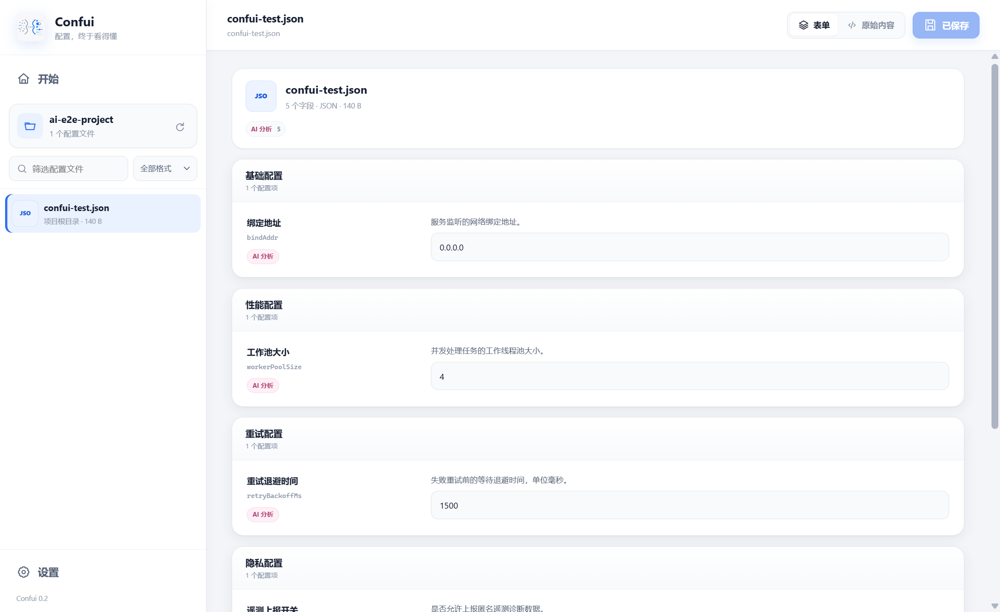

# Confui

Confui 是一个 Windows 桌面配置编辑器。选择本地项目后，它会发现配置文件、组合项目中的 Schema / 示例 / README 信息，并把字段转换成可校验的表单。用户确认差异后，Confui 才会写回原文件。设置页支持手动检查 GitHub Release 更新。



## 社区

本项目已链接 LINUX DO 社区，欢迎在社区交流使用体验和反馈：<https://linux.do/>

## 支持范围

| 格式 | 读取 | 保存策略 |
| --- | --- | --- |
| JSON / JSONC | 支持注释、尾随逗号 | AST 增量编辑，保留注释、缩进和键顺序 |
| ENV | 支持 `export`、引号和注释 | 逐行修改，保留相邻内容 |
| INI / CFG / CONF | 支持节与键 | 逐行修改 |
| Java Properties | 支持转义键 | 逐行修改 |
| YAML | 完整解析 | 保存前提示可能重新排版或丢失注释 |
| TOML | 完整解析 | 保存前提示可能重新排版或丢失注释 |

JavaScript / TypeScript 配置文件不会被伪装成 JSON 打开。范例文件、锁文件、Schema 文件和构建目录也不会出现在可编辑列表里。

## 推断顺序

每一层都可以为同一个字段贡献不同属性，合并单位是字段属性，而不是整条字段：

1. JSON Schema
2. 内置常见配置模板
3. `*.example` / `*.sample` / `*.template` / `*.dist`
4. 本地 README；本地缺失时可回退到 GitHub README
5. 用户配置的 OpenAI 兼容 AI 服务
6. 当前值的结构推断

例如，Schema 可以提供整数范围，README 提供中文说明，示例文件提供默认值，而当前文件始终提供实际值。

## 保存安全

- Renderer 只能通过 `contextBridge` 调用白名单 IPC；没有 HTTP 后端。
- 路径会限制在用户选择的项目目录中。
- 保存前展示逐字段差异。
- 保存时校验文件 hash，拒绝覆盖外部修改。
- 写入前生成 `.bak`，再通过同目录临时文件原子替换。
- API Key 与 GitHub Token 使用 Electron `safeStorage` 加密。
- 发给 AI 的配置会先按字段名屏蔽 Token、密码、密钥等敏感值。

## 开发

要求 Node.js 20.19+，在 Windows PowerShell 中运行：

```powershell
npm install
npm run dev
```

完整检查：

```powershell
npm run check
```

生成便携桌面应用：

```powershell
npm run package
```

输出位于 `release/Confui-win32-x64/Confui.exe`。发布时需要保留同目录的 DLL、`locales` 与 `resources`，它不是单文件程序。

## 目录

```text
core/       扫描、格式、推断、AI、设置与安全保存
electron/   主进程和安全 Preload 桥
shared/     IPC 与 Form Schema 契约
web/        Preact 桌面界面
tests/      单元、集成与端到端测试项目
scripts/    确定性便携打包脚本
```

## 已知边界

- GitHub 链接只用于本地 README 缺失时补充文档；编辑仍需要本地项目文件夹。
- YAML / TOML 的语义会保留，但第三方解析器无法承诺完整保留注释和原排版，因此保存前会明确提示。
- AI 是可选的最后回退层；未配置供应商时，其余推断能力仍可正常工作。
